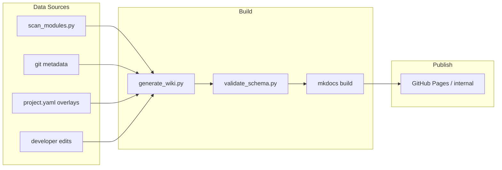

# Module Wiki — 5-day implementation plan

## Executive summary

Build a **git-native, Markdown-first module wiki** that:

1. Starts from Niaj's existing scan (`scan_modules.py` → 2,356 modules / 38 projects)
2. Adds human-readable layers (client, brief, version narrative, reuse tags)
3. Deploys as static docs (MkDocs Material → GitHub Pages or internal nginx)
4. Automates 70–80% via CI; developers only fill gaps machines cannot infer

**Pilot created:** `By-Project/module-wiki/` with **Agile Minds** as reference project and 3 fully documented modules.

---

## What Niaj already built (strong foundation)

| Asset | Value |
|-------|-------|
| `scan_modules.py` | Walks addons tree, parses `__manifest__.py`, filters Odoo core / l10n / OCA noise |
| `odoo_module_inventory.md` | 2,356 custom modules across 38 top-level folders |
| `generate_excel.py` | Management-friendly export |
| Filters | Sensible exclusions (enterprise, odoo-server, l10n_*) |

**Gaps to close for full wiki:**

| Gap | Proposed source |
|-----|-----------------|
| Client name vs folder slug | `project.yaml` overlay (CRM / PM spreadsheet) |
| Git remote URL | `git remote -v` in each repo |
| Version *history* | `git log` on `__manifest__.py` + optional `CHANGELOG.md` per module |
| “What’s new” narrative | PR titles / developer 1-liner on release |
| True reuse graph | Cross-project duplicate `technical_name` (see reuse matrix) |
| Marketing copy | `marketing_summary` field — AI-assisted draft, human approve |

---

## Recommended architecture



### Why MkDocs Material (not Confluence / Notion)

| Criterion | MkDocs + Git | Wiki SaaS |
|-----------|--------------|-----------|
| Developer friction | Edit in IDE, same as code | Context switch |
| Deploy | `mkdocs gh-deploy` or CI | Manual |
| Onboarding | Copy template, PR | Permissions / licenses |
| Automation | Generate `.md` from scan | API limits |
| Offline / internal | Static HTML on any server | Vendor lock-in |

Alternatives considered: **Docusaurus** (heavier, JS ecosystem), **GitBook** (paid, less scriptable), **Odoo website** (dogfooding but worse DX for bulk docs).

---

## Information model (maps to your 6 requirements)

| # | Requirement | Storage |
|---|-------------|---------|
| 1 | Project brief | `projects/<slug>/project.yaml` → `brief` |
| 2 | Client details | `project.yaml` → `client` object |
| 3 | Modules list | Generated table on project `index.md` |
| 4 | Module brief | `modules/<name>.md` body + manifest seed |
| 5 | Who worked | `contributors[]` (+ `git shortlog` hints) |
| 6 | Tech name, git, versions, what's new | YAML front-matter `git`, `versions[]` |

Schemas live in `module-wiki/_schema/`.

---

## 5-day rollout (working days)

### Day 1 — Validate structure (today)

- [x] Pilot wiki folder + Agile Minds sample (3 modules)
- [ ] Niaj + 2 devs review pilot in `mkdocs serve`
- [ ] Sign-off on schema fields (add/remove before bulk import)
- [ ] Copy `scan_modules.py` into `module-wiki/scripts/`

### Day 2 — Bulk seed + project overlays

- [ ] `generate_projects.py`: MD inventory → `projects/<slug>/index.md` stubs for all 38 folders
- [ ] PM spreadsheet → `project.yaml` for top 10 active clients
- [ ] Flag generic folders (`odoo17_custom`) for client mapping

### Day 3 — Git enrichment

- [ ] `enrich_git.py`: remote URL, last commit date, authors per module path
- [ ] `enrich_versions.py`: parse manifest version changes from git history
- [ ] Build `reuse-matrix.md` automatically from inventory

### Day 4 — CI, deploy, onboarding

- [ ] GitHub Actions: validate YAML + build MkDocs on PR
- [ ] Deploy to GitHub Pages (private repo + SSO) or internal VM
- [ ] `CONTRIBUTING.md` + module template distributed to all devs (email / Slack)

### Day 5 — Marketing layer + handoff

- [ ] `catalog.md` auto-generated for all `meta_*` modules with `reusable: true`
- [ ] Management walkthrough: Excel export still available, wiki is source of truth
- [ ] Backlog: Odoo.sh webhook, pre-commit hook in addon repos

---

## Developer workflow (minimal manual input)

1. **On new module:** copy `templates/module.md`, fill front-matter (2 min)
2. **On version bump:** append one row to `versions[]` (1 min) — _future: pre-commit hook_
3. **On release:** CI runs scan, fails if manifest version ≠ latest wiki version
4. **Never:** duplicate data in Excel and wiki — Excel generated from wiki YAML

### Autonomy ladder

| Level | Trigger | Human effort |
|-------|---------|--------------|
| L0 | Server cron runs `scan_modules.py` | 0 |
| L1 | CI regenerates project module tables | 0 |
| L2 | Git enrichment suggests contributors | approve |
| L3 | AI drafts `marketing_summary` from manifest + code | approve |
| L4 | Pre-commit in addon repo updates wiki via submodule / bot PR | 1 line whats_new |

---

## Addressing the pain points

### “Which module for which project?”

Project pages list all modules; global search (MkDocs) across 2k pages. Breadcrumb: `Projects → Agile Minds → meta_pos_partner_credit_sale`.

### “What can be reused?”

- `reusable: true` tag
- Auto **reuse matrix** (same `technical_name` in N projects)
- Filter catalog: `meta_*` only, exclude third-party authors from scan

### “Marketing visibility”

- `modules/catalog.md` — product-sheet style
- `marketing_summary` on each reusable module
- Optional export: `generate_product_sheet.py` → PDF per module (reuse metamorphosis-documentation patterns later)

---

## Risks & mitigations

| Risk | Mitigation |
|------|------------|
| Folder name ≠ client (`basb`, `mm_project`) | `project.yaml` display_name + aliases |
| Duplicate modules diverged across repos | Link to canonical git path; note drift in module page |
| Wiki rots without discipline | CI fail on manifest/wiki version mismatch |
| 2,356 pages overwhelming | Start with `meta_*` (~40% of value); phase third-party |
| Sensitive client data | Private repo; no credentials in wiki; contacts optional |

---

## Immediate next steps for Niaj & team

1. Run locally: `cd module-wiki && pip install mkdocs-material && mkdocs serve`
2. Review Agile Minds pilot — confirm 6 requirements are satisfied
3. Each dev re-runs `scan_modules.py` on their machine path; PR merged inventory monthly
4. Fill `git.remote_url` for Agile Minds pilot
5. Approve Day 2 bulk import or request schema changes

---

## Files in pilot

```text
module-wiki/
  mkdocs.yml
  docs/
    index.md
    contributing.md
    schema.md
    projects/agile_minds_odoosh/
      project.yaml
      index.md
      modules/*.md (3 complete)
    modules/catalog.md
    modules/reuse-matrix.md
  _schema/
  templates/module.md
  PLAN.md (this file)
```
